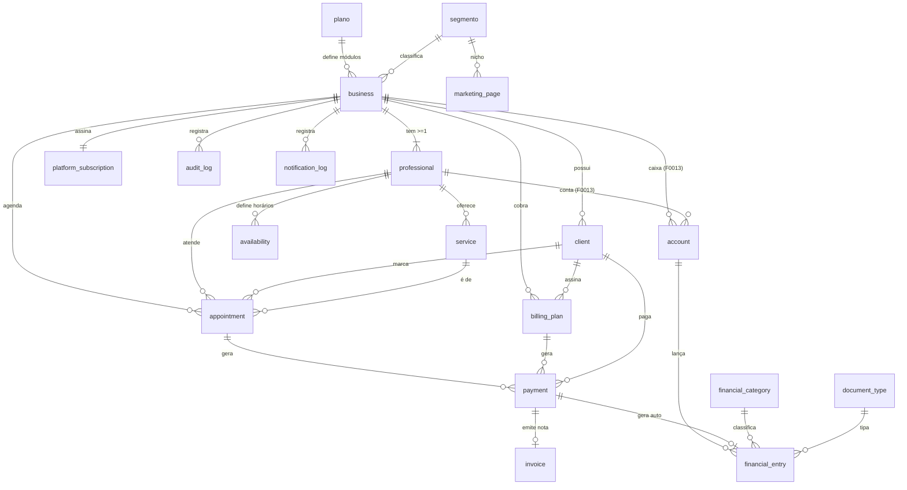

# Modelo de Dados — Coleções MongoDB

> **Fronteira de dados persistidos** (P2S, pilar 2). O diagrama ER abaixo é a **visão navegável**
> do modelo — renderiza inline (Mermaid) e é a referência aprovada; os detalhes de campo por
> coleção seguem em cada seção.

## Diagrama ER

## plano
Configuração comercial (seed manual via Mongo).
- `slug`, `nome`, `descricao`
- `modulos`: `{ agenda: boolean, agendaPublica: boolean, cobranca: boolean, nfse: boolean, financeiro: boolean }`
- `precoBase`: Cobre a 1ª agenda.
- `precoPorAgendaAdicional`: R$ por professional além do 1º (0 se sem agenda).
- `ativo`: boolean.
- *Exemplos*: "Agenda Simples", "Cobrança + Nota", "Completo".

## segmento
Lista **controlada** de segmentos de atuação (seed administrativo). Alimenta o `<select>` do onboarding — **nunca** texto livre.
- `slug` (único), `nome`, `ativo`, `ordem` (ordenação no select).
- *Regra*: `business.segmento` referencia o `slug` de um `segmento` **ativo** (validado na criação).
- *Futuro (F12)*: vínculo com `marketing_page`/hotsites por nicho (via `slug`).

## business
Conta/tenant principal.
- `googleId`, `nomeFantasia`, `slug` (único, `/agendar/{slug}`), `email`, `segmento` (slug de um `segmento` ativo — lista controlada, sem texto livre).
- `planoId` (**nullable** — `null` durante o trial até o usuário escolher um plano no painel; ver F0011), `modulos`. **Regra de módulos (F0002.6):** enquanto `planoId` é `null` (trial), `modulos` = **sistema completo** (todos `true`) para o usuário testar tudo; ao escolher o plano, `modulos` é **copiado do plano**.
- `cpfCnpj` (nullable).
- `billingConfigPadrao` (nullable): 
  { 
    asaasApiKeyEncrypted, 
    nfseStrategy (AUTO_AFTER_PAYMENT|MANUAL_PER_PAYMENT|MANUAL_BATCH),
    codigosFiscais { municipalServiceCode, nbsCode, taxSituationCode, taxClassificationCode, operationIndicatorCode } 
  }.
- `onboardingStatus` (PENDING|COMPLETE).
- `createdAt`, `updatedAt`.

## professional
Identidade/agenda (mínimo 1 por business).
- `businessId`, `nome`, `slugInterno` (único no business).
- `whatsapp`, `bio`, `fotoUrl`, `redesSociais` (nullable).
- `billingConfig` (nullable - override; null = herda business):
    { 
      asaasApiKeyEncrypted, 
      nfseStrategy,
      codigosFiscais {...}, 
      cpfCnpj 
    }.
- `ativo`: boolean.
- `createdAt`, `updatedAt`.

## service
- `professionalId`, `nome`, `duracaoMinutos`, `valor`, `ativo`.
- *Regra*: Só existe se `modulos.agenda`.

## availability
- `professionalId`, `diaSemana`, `horaInicio`, `horaFim`, `slotMinutos`.
- *Regra*: Só existe se `modulos.agenda`.

## client
- `businessId`, `nome`, `telefone`, `email`.
- `tipoPessoa` (FISICA|JURIDICA), `cpfCnpj`, `inscricaoMunicipal` (nullable).
- `endereco` (nullable), `dadosFiscaisToken`, `dadosFiscaisCompletos`: boolean.

## appointment
- `businessId`, `professionalId`, `clientId`, `serviceId`, `dataHora`.
- `status` (PENDING_CONFIRMATION|CONFIRMED|CANCELED|COMPLETED).
- `origem` (PUBLICO|MANUAL).
- `recorrente`: boolean, `billingPlanId` (nullable).

## billing_plan
Plano de cobrança recorrente para o Cliente Final.
- `clientId`, `businessId`, `professionalId` (opcional - apenas referência).
- `valor`, `periodicidade`, `diaCobranca`.
- `formaPagamento` (PIX|BOLETO), `status` (ACTIVE|PAUSED|CANCELED), `asaasSubscriptionId`.
- *Regra*: Vinculado ao **Business** (Tenant). O token Asaas usado é definido pelo Business (seja o padrão ou override do profissional no momento da criação). Máximo 1 plano ACTIVE por cliente por Business.

## payment
- `businessId`, `professionalId` (nullable), `clientId`, `appointmentId` (nullable), `billingPlanId` (nullable).
- `asaasPaymentId` (índice único), `valor`, `vencimento`.
- `status` (PENDING|RECEIVED|OVERDUE|REFUNDED), `dataPagamento`, `invoiceUrl`.

## invoice
- `paymentId` (nullable - nulo se emissão manual).
- `businessId`, `professionalId` (nullable), `asaasInvoiceId`.
- `status` (PENDING_CLIENT_DATA|SCHEDULED|AUTHORIZED|ERROR|CANCELED).
- `origem` (AUTOMATICA|MANUAL), `numero`, `pdfUrl`, `erroMsg`.
- *Regra*: Emissão manual ou revisão é feita pelo Gestor do Tenant ou pelo Profissional.

## audit_log
- `entidade`, `entidadeId`, `acao`, `payloadResumido`, `timestamp`.

## platform_subscription
Assinatura do negócio com a plataforma (Paulo).
- `businessId` (único), `planoId` (**nullable** — `null` durante o trial; definido quando o usuário escolhe o plano no painel, F0011), `status` (TRIAL|GRACE|ACTIVE|CANCELED).
- `trialEndsAt`, `graceEndsAt`.
- `qtdAgendasAtivas`, `valorMensal`.
- `asaasSubscriptionId`, `asaasPaymentIdAtual`.

## account *(F0013 — habilitado por `modulos.financeiro`)*
Conta/caixa financeira do Tenant.
- `businessId`, `nome`, `tipo` (CAIXA|BANCO|CARTEIRA), `saldoInicial`, `ativo`.
- `professionalId` (nullable — conta de um profissional; null = conta geral do business).
- *Regra*: cada `professional` deve ter **ao menos uma** conta utilizável (própria ou a conta padrão do business apontada pelo usuário).

## financial_category *(F0013)*
Lista controlada de categorias de lançamento.
- `businessId`, `nome`, `tipo` (RECEITA|DESPESA), `ativo`.

## financial_tag *(F0013)*
- `businessId`, `nome`, `ativo`.

## document_type *(F0013)*
Tipos de documento dos lançamentos (ex.: Boleto, Recibo, Nota, Pix).
- `businessId`, `nome`, `ativo`.

## financial_entry *(F0013)*
Lançamento a pagar/receber.
- `businessId`, `accountId`, `professionalId` (nullable).
- `tipo` (PAGAR|RECEBER), `status` (PREVISTO|PAGO|RECEBIDO|CANCELADO).
- `valor`, `vencimento`, `dataPagamento` (nullable), `descricao`.
- `categoriaId` (nullable), `tags` ([tagId]), `documentTypeId` (nullable), `documentoNumero` (nullable).
- `origem` (MANUAL|AUTOMATICA), `paymentId` (nullable — vínculo ao `payment` Asaas quando gerado automaticamente).
- *Regra*: geração automática a partir de `payment` RECEBIDO é **idempotente** (1 lançamento por pagamento) e só ocorre com `cobranca` **e** `financeiro` ativos.

## marketing_page
- `slug` (ex: `/para/{slug}`), `segmento`, `heroTitle`, `heroSubtitle`, `features`.
- `depoimento`, `planoId` (CTA leva ao onboarding), `ativo`.

## notification_log
- `tipo`, `destinatarioEmail`, `entidadeTipo`, `entidadeId`, `status`, `erroMsg`.
